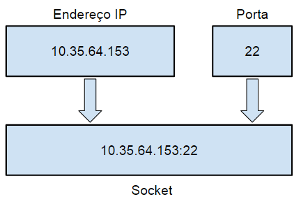
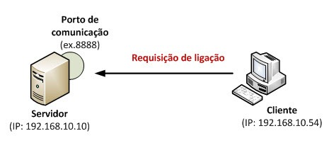
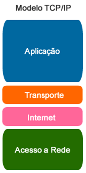

<h1 align="center"><i>VendePass</i></h1>

 Uma interface de socket para venda de passagens aéreas.

## Introdução
Desde o primeiro voo de Santos Dumont, a aviação evoluiu rapidamente, passando de uma curiosidade tecnológica a um dos principais meios de transporte no mundo. Inicialmente restrito a elites e serviços militares, o transporte aéreo começou a se popularizar após a Segunda Guerra Mundial, com a expansão de rotas comerciais. A democratização do acesso ao transporte aéreo tem-se acelerado nas últimas décadas, impulsionada pelo surgimento de companhias aéreas de baixo custo que revolucionaram o setor ao oferecer tarifas mais acessíveis e ampliar a conectividade global. Nesse contexto, a tecnologia de venda de passagens aéreas desempenha um papel central, permitindo que sistemas de reserva e processamento de bilhetes acompanhem a evolução e a complexidade desse setor.

Pensando nisso, foi proposto aos alunos do curso de Engenharia de Computação da Universidade Estadual de Feira de Santana(UEFS) o desenvolvimento de um sistema de comunicação usando a interface de socket nativa do TCP/IP para venda de passagens aéreas em um modelo cliente-servidor. Este relatório visa descrever objetivamente o desenvolvimento de tal solução em que os clientes, através da internet, podem comprar passagens para um destino escolhendo os trechos e assentos disponíveis. Além disso, o servidor armazena o grafo das rotas e voos provendo serviços de listagem das rotas, compra de trechos e reserva de assento(s) aos usuários. Ao final do desenvolvimento, a aplicação foi virtualizada por meio de contêineres Docker.

## Fundamentação teórica

 <b>Interface de Programação de Aplicação (API)</b> 

Interface de Programação de Aplicação ou <i>Application Programming Interface</i> (API) é mecanismo que permite a comunicação entre dois componentes de <i>software</i> ou aplicações através de um conjunto de definições e protocolos. APIs conectam soluções e serviços, sem a necessidade de saber como esses elementos foram implementados, o que simplifica o design e favorece a colaboração entre soluções e serviços. 

Por exemplo, a aplicação para a previsão do tempo em um telefone requer dados meteorológicos que exigiriam um sistema robusto no celular para o acesso às previsões. Entretanto, com o uso de uma API, a aplicação no dispositivo pode acessar e se comunicar com o sistema de software do instituto meteorológico na nuvem solicitando informações para o usuário sem implementar toda a complexidade do sistema no telefone, por exemplo.

 <b>Sockets</b> 

Soquetes são canais de comunicação que permitem a processos não relacionados a troca de dados localmente e através de redes. Um único soquete é um ponto final de um canal de comunicação de duas vias (“Soquetes”, [s.d.]).

Um soquete de rede (ou socket) é uma interface de programação que permite a comunicação entre processos, seja no mesmo dispositivo ou em dispositivos diferentes. Essa comunicação ocorre por meio da rede, utilizando uma combinação de endereços Protocolo Internet (IP) e números de porta, como demonstrado na Figura 1. Um único soquete é um ponto final de um canal de comunicação de duas vias, e sua função principal é facilitar a troca de dados entre dois pontos (“Soquetes”, [s.d.]).

Para configurar um soquete, é necessário definir dois componentes principais: o domínio de comunicação (nome ou espaço de endereço) e o protocolo de transporte. Esses dois elementos determinam como os dados serão transmitidos pela rede (STEVENS et al, 2003).

  <figure>  
    
    <figcaption>
      
 

**Figura 1** - Exemplo de endereço IP e Porta para configuração do soquete
    </figcaption>
  </figure>

Domínios básicos:
- INTERNET (AF_INET) - os endereços consistem do endereço de rede da máquina e da identificação do nº da porta, o que permite a comunicação entre processos de sistemas diferentes. O soquete pode usar endereços IPv4, permitindo a comunicação via endereços IP de 32 bits, ou IPv6 (AF_INET6), com suporte a endereços de 128 bits, projetados para resolver o problema da exaustão de endereços IPv4. 
- Unix (AF_UNIX) - os processos se comunicam referenciando um pathname,
dentro do espaço de nomes do sistema de arquivos

Já os protocolos de transporte, segundo Tanenbaum (2011), determinam como os dados são transferidos entre os dispositivos. Os mais comuns são:

- Protocolo de Controle de Transmissão ou <i>Transmission Control Protocol</i> (TCP): Um protocolo orientado à conexão que garante a entrega confiável dos pacotes. O TCP estabelece uma conexão antes de começar a transmissão de dados, verificando erros e retransmitindo pacotes perdidos, o que o torna adequado para aplicações que precisam de confiabilidade, como a transferência de arquivos ou navegação na web.

- Protocolo de Dtagrama do Usuário ou <i>User Datagram Protocol</i> (UDP): Um protocolo não orientado à conexão, que envia pacotes sem a necessidade de estabelecer uma conexão prévia. Embora seja mais rápido que o TCP, não garante a entrega dos pacotes, o que o torna ideal para aplicações que priorizam a velocidade e a eficiência sobre a confiabilidade, como transmissões de vídeo ou jogos online.

- Protocolo Raw: Permite o acesso direto aos pacotes IP, sem passar pelos protocolos de transporte TCP ou UDP. É utilizado em aplicações de baixo nível, como testes de rede e ferramentas de diagnóstico.

 <b>Plataforma Docker</b> 

O Docker é uma plataforma de software open source que permite a criação, o teste e a implantação de aplicações rapidamente. Esta solução cria pacotes de software em unidades padronizadas e independentes chamadas de contêineres que têm tudo o que o software precisa para ser executado, inclusive bibliotecas, ferramentas de sistema e  código sem demandar que todos estes recursos sejam instalados na máquina física. Ao usar o Docker, é possível implantar, padronizar as operações e escalar rapidamente aplicações em qualquer ambiente com facilidade e melhor  utilização de recursos.(“AWS Docker - Amazon Web Services”, [s.d.]).

## Metodologia
Para solucionar o problema proposto, as temáticas de sistemas distribuídos com uso de API socket e protocolo TCP/IP foram discutidas e diferentes abordagens analisadas. Para tal execução, a linguagem de programação Pyhton foi escolhida implementando a interface nativa do socket.

O sistema simula rotas de tráfego aéreo nas principais cidades da Bahia. Uma vez que cada voo ou rota representa a relação entre um aeroporto de origem e outro de destino, a estrutura de grafo direcionado, implementado em listas de adjacências, foi utilizada para modelar os conjuntos de objetos que tenham relacionamentos entre si. As características e estrutura do grafo permite representar redes de grandes conjuntos de dados e percorrer sequencias de nós e arestas com eficiência. Assim sendo, esta estrutura se mostrou muito adequada para a implementação de uma rede de tráfego aério, onde os vértices representam os aeroportos, nomeados com suas respectivas siglas explicitadas no Quadro 1, e as arestas referem-se às rotas ou vôos que partem de um aeroporto com destino a outro

Legenda AEROPORTOS
- (SSA) Salvador - Aeroporto Deputado Luís Eduardo Magalhães
- (IOS) Ilhéus - Aeroporto de Ilhéus - Jorge Amado
- (BPS) Porto Seguro - Aeroporto de Porto Seguro
- (LEC) Lençóis - Aeroporto Horácio de Mattos
- (PAV) Paulo Afonso- Aeroporto de Paulo Afonso
- (BRA) Barreiras - Aeroporto de Barreiras
- (FEC) Feira de Santana - Aeroporto João Durval Carneiro
- (VAL) Valença - Aeroporto de Valença
- (GNM) Guanambi - Aeroporto de Guanambi
- (TXF) Teixeira de Freitas - Aeroporto de Teixeira de Freitas
- (VDC) Vitória da Conquista - Aeroporto Glauber de Andrade Rocha

| Origem   |  Destino  | Voo         |  Duração |
---------- |-----------|-------------|--------  |
|  SSA    |  FEC       | Voo AB123   |    40m   |
|  SSA    |  FEC       | Voo AB456   |    45m   |
|  SSA    |  LEC       | Voo AC789   |   1h25m  |
|  SSA    |  PAV       | Voo AC490   |   2h     |
|  SSA    |  GNM       |  Voo AB7377  |   1h45m  |
|  SSA    |  VDC       |  Voo AC364   |   2h20m  |
|  SSA    |  IOS       |  Voo AB912   |   2h     |
|  FEC    |  SSA       |  Voo BA321   |   45m    |
|  FEC    |  LEC       |  Voo BC654   |   25m    |
|  FEC    |  VDC       |  Voo 337     |   1h35m  |
|  VDC    |  FEC       |  Voo CE321   |   1h20m  |
|  VDC    |  GNM       |  Voo BC490   |   40m    | 
|  VDC    |  TXF       |  Voo AD499   |   25m    |
|  LEC    |  SSA       |  Voo CA987   |   1h30m  |
|  LEC    |  FEC       |  Voo CB654   |   25m    |
|  BPS    |  FEC       |  Voo CB957   |   2h     |
|  BPS    |  BRA       | Voo CB174    |   2h15m  |

 

**Quadro 1** - Rotas do grafo de tráfero aéreo da Bahia. Cada voo representa uma aresta que relaciona um nó (aeroporto de origem) a outro nó (aeroporto de destino).

### Arquitetura da Solução

A solução desenvolvida utiliza o modelo de arquitetura de rede cliente-servidor. Nesta infraestrututra, a iteração é dada através envio de solicitações ou requisições pelo dito cliente que aguarda a resposta do lado denominado servidor. Desse modo, o servidor pode ser definido como um sistema computacional que armazena dados e provê serviços para serem consumidos pelos clientes, que também podem ser outros sistemas.  
Um socket é uma abstração da camada de rede que permite a comunicação entre diferentes aplicações que precisam se comunicar via rede. Através do seu uso, é possível definir  um servidor e clientes conectados a ele para solicitar serviços. 

Na solução baseada na API socket, o servidor disponibiliza um endereço IP e uma porta onde espera as conexões, os pedidos a serem processados e respondidos de acordo com os parâmetros da solicitação. Assim, os clientes conectados ao socket do servidor enviam requisições formatadas e aguardam o processamento e resposta, que será decodificada e disponibilizada ao usuário final. Tal situação é exemplificada na Figura 2. 

No sistema VendePass, o servidor é responsável pelos serviços de login, listagem de rotas e compra de passagens a serem requisitados pelos clientes. Para tal, faz-se necessário também o armazenamento de dados, autenticação dos usuários, busca de rotas, codificação e decodificação de mensagens. Já o cliente, recebe as entradas do usuário, codifica a solicitação para determinado serviço a ser enviada ao servidor e, finalmente, decodifica sua resposta para o usuário.

  <figure>  
    
    <figcaption>
      
 

**Figura 2** - Exemplo da intercomunicação entre duas vias por meio de soquetes no modelo cliente-servidor

    </figcaption>
  </figure>

### Paradigma de Comunicação
Para o desenvolvimento da solução, o paradigma de comunicação foi adotado devido à sua eficiência, simplicidade e escalabilidade para aplicações distribuídas. Neste modelo, cada solicitação de comunicação entre cliente e servidor é tratada de forma independente, sem depender do histórico de interações anteriores. Ou seja, o servidor não mantém informações sobre as interações passadas ou o "estado" da comunicação com o cliente. Cada solicitação contém todas as informações necessárias para ser processada, e após a resposta, o servidor não mantém registro dessa solicitação.

Esse paradigma simplifica o design de sistemas, especialmente em arquiteturas distribuídas e em larga escala, onde a manutenção do estado entre solicitações pode ser onerosa ou complexa (TANENBAUM; WETHERALL, 2011).

### Protocolo de Comunicação
Dado o uso da rede internet na solução, o conjunto de protocolos Transmission Control Protocol/ Internet Protocol (TCP/IP) foi utilizado. Este conjunto de protocolos específicos, organizados nas camadas exibidas na Figura 3, descreve como os dados devem ser transmitidos de um dispositivo para outro por meio de uma rede. 

  <figure>  
    
    <figcaption>
      
 

**Figura 1** - Exemplo de endereço IP e Porta para configuração do soquete
    </figcaption>
  </figure>

A arquitetura TCP/IP (Transmission Control Protocol/Internet Protocol) reune os protocolos IP da camada de rede, TCP e UDP da camada de transporte e é o modelo básico de comunicação em redes, especialmente na internet. Sua divisão em camadas, com protocolos distintos para cada função, garante flexibilidade, escalabilidade e confiabilidade, permitindo que diferentes redes e dispositivos interajam de maneira eficiente e robusta.

Para garantir a confiabilidade e integridade dos dados na comunicação entre cliente e servidor, o protocolo TCP foi adotado juntamente com o endereçamento IPv4 por meio de um STREAM SOCKET.

### Formatação e tratamento de Dados

Para o trágefo de dados entre cliente e servidor, o Javascript Object Notation (JSON) foi utilizado. Este padrão amplamente adotado em aplicações na transmissão e armazenamento de dados é baseado em texto e tem como vantagem sua estrutura leve, simplicidade e versatilidade, compativel com diversas plataformas e linguagens de programação. 

Diante da organização dos dados no formato JSON em uma estrutura de chave-valor, as requisições e respostas tem um padrão: 
- `tipo`: string que identifica o tipo da mensagem, seja ela uma requisição ou resposta, ex: 'LOGIN', 'LOGIN_RESPOSTA'.
- `dado`: dicionário de dados associado a mensagem.

## Resultados e Discussões
### Tratamento de Conexões Simultâneas
Visando a realização de múltiplas operações ao mesmo tempo na plataforma de venda de passagens, onde diversos usuários realizam transações de forma simultânea, a técnica de multithread foi implementada. Dessa maneira, cada solicitação de compra de passagem pode ser tratada por uma thread separada, permitindo que vários usuários realizem suas transações ao mesmo tempo de momo independente uns dos outros.

A otimização do paralelismo inclui também o desacoplamento das operações de entradas e saídas de dados e validação das operações de processamento. Além disso, minimizar as seções críticas reduz a perda de eficiência no controle de acesso aos recursos compartilhados.

Essas estratégias são essenciais em sistemas com muitos acessos concorrentes e garantem a melhor usuabilidade da aplicação.
### Tratamento de Concorrência
No sistema de venda de passagens com conexões simultâneas, existem recursos compartilhados, a exemplo do arquivo de usuários e rotas, que exigem um controle de concorrência para evitar problemas como inconsistência dos dados. Desse modo, nas seções necessárias mutexes foram implementados para garantir a exclusão mútua e a confiabilidade dos dados.
Os pontos onde os mutexes foram inseridos correspondem ao processo de autenticação do usuário, consulta de rotas e reserva de assento.

### Confiabilidade do Sistema

Para garantir a confiabilidade do sistema, o tratamento de exceções foi implementado nos pontos de conexão com o servidor e no envio e recebimento de mensagens. Assim, 

### Docker
O uso da plataforma Docker otimiza a execução do sistema ao dispensar a configuração de cada máquina física. Através de dois containers, sendo um para o servidor e um para o cliente, a aplicação pode ser executa em diferentes máquinas com a plataforma Docker.

### Desempenho e Avaliação
Para avaliação e comparação do desempenho do sistema, scripts para a simulação de 5, 10 e 20 usuários conectados simultaneamente foram executados. Comparando-se a performance da execução sequencial e multithread, em todos os cenários avaliados a execução multithread atendeu aos clientes em menor tempo.
## Conclusão
A solução abordada desenvolveu um sistema de venda de passagens aéreas utilizando a arquitetura cliente-servidor e a interface de sockets nativa do TCP/IP atendendo aos requisitos definidos. O sistema provê serviços de busca, compra de passagens e reserva de assetos ultilizando estratégias multrithread para conexões simulâneas e mutexes para controle de concorrência. Dessa forma, o projeto apresentou desempenho satisfatório podendo, futuramente, incluir interface gráfica, criptografia dos dados de usuários e integração com banco de dados.

## Referências

AWS Docker - Amazon Web Services. Disponível em: <https://aws.amazon.com/pt/docker/>.

Soquetes. Disponível em: <https://www.ibm.com/docs/pt-br/aix/7.3?topic=concepts-sockets>.

Stevens, W. R., Fenner, B., & Rudoff, A. M. (2003). Unix network programming. Volume 1: The sockets networking API. Pearson Education.

Tanenbaum, A. S., & Wetherall, D. J. (2011). Redes de computadores. 5ª ed. Rio de Janeiro: Pearson.

‌
